# Setup Oracle Kubernetes Engine to orchestrate the Docker image #

Oracle Kubernetes Engine is a fully-managed, scalable, and highly available service that you can use to deploy your containerised applications to the cloud, in this case existing WebLogic domain. Beside that OKE used when your development team wants to reliably build, deploy, and manage cloud-native applications. You specify the compute resources that your applications require, and Container Engine for Kubernetes provisions them on Oracle Cloud Infrastructure in an existing OCI tenancy automatically.

### Prerequisites ###

[Oracle Cloud Infrastructure](https://cloud.oracle.com/en_US/cloud-infrastructure) enabled system administrator account. If you are not in the Administrators group, then following user policy statements are required:
+ allow group <group-name> to manage instance-family in <location>
+ allow group <group-name> to use subnets in <location>
+ allow group <group-name> to read virtual-network-family in <location>
+ allow group <group-name> to use vnics in <location>
+ allow group <group-name> to inspect compartments in <location>
+ allow group <group-name> to manage cluster-family in <location>

An example user policy statement is **allow group dev-team to manage cluster-family in tenancy**
For additional guidance with OKE IAM policies for features such as 'QUICK CREATE', please visit [Policy Configuration for Cluster Creation and Deployment](https://docs.cloud.oracle.com/iaas/Content/ContEng/Concepts/contengpolicyconfig.htm).

This tutorial shows the simplest way the *Quick Start* feature creates and configures all the necessary resources for a Kubernetes 3 node cluster. All the nodes will be deployed in different Availability Domains to ensure high availability.

More information about OKE and custom cluster deployment [Oracle Container Engine documentation](https://docs.cloud.oracle.com/iaas/Content/ContEng/Concepts/contengoverview.htm)

#### Open the OCI console ####

Sign in to your Oracle Cloud Account and in the console open the navigation menu. Under Solutions and Platform, go to Developer Services and click Container Clusters (OKE).

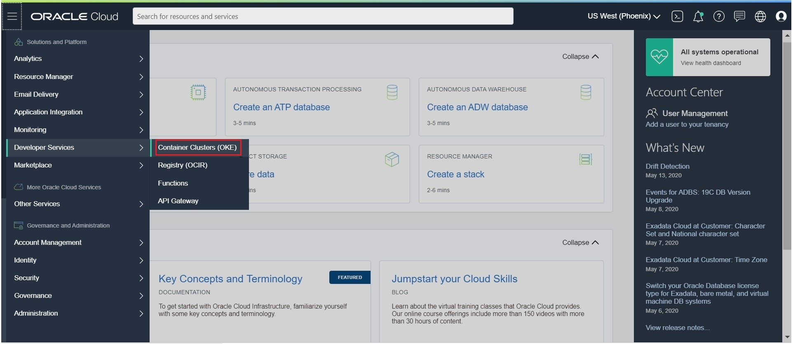

Choose a Compartment you have permission to work in. Here we will use soademo compartment. On the Cluster List page, select the Compartment as soademo and click Create Cluster.

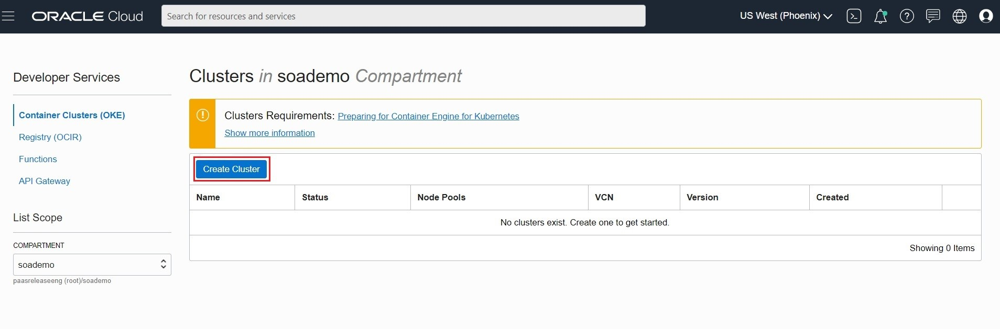

In the Create Cluster dialog, select Quick Create and click Launch Workflow.

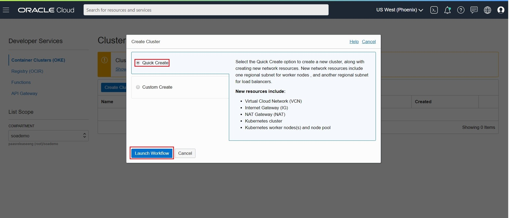

On the Create Cluster page specify the below values:
+ NAME: soaoke
+ COMPARTMENT: soademo
+ KUBERNETES VERSION: v1.15.7 or v1.16.8
+ CHOOSE VISIBILITY TYPE: Private or Public
+ SHAPE: VM.Standard2.1  (Choose the available shape for worker node pool. The list shows only those shapes available in your tenancy that are supported by Container Engine for Kubernetes. See [Supported Images and Shapes for Worker Nodes](https://docs.cloud.oracle.com/en-us/iaas/Content/ContEng/Reference/contengimagesshapes.htm).)
+ NUMBER OF NODES:  3 (The number of worker nodes to create in the node pool, placed in the regional subnet created for the 'quick cluster').
+ Click Show Advanced Options and enter PUBLIC SSK KEY:  ssh-rsa AA......bmVnWgX/ (public key from your PuTTy GEN or SSH-KEYGEN) 

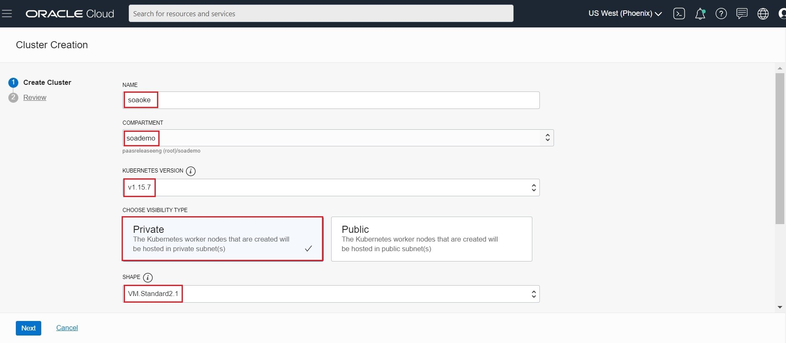

Next to review the details you entered for the new cluster.

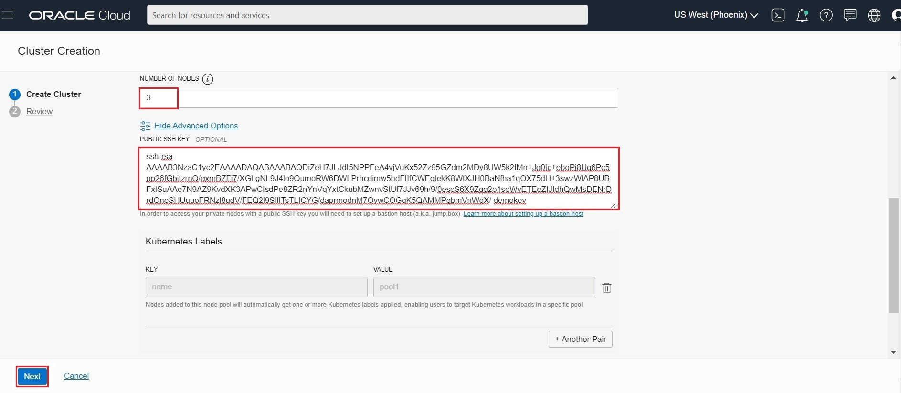

Click Create Cluster to create the new network resources and the new cluster.

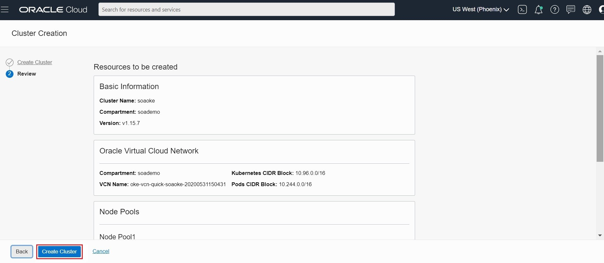

Container Engine for Kubernetes starts creating resources (as shown in the Creating cluster and associated network resources dialog). Click Close to return to the Console.

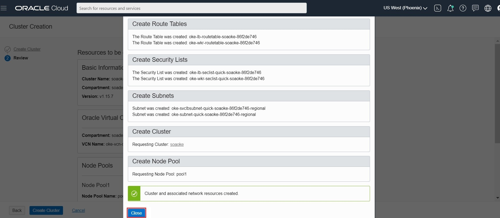

Initially, the new cluster appears in the Console with a status of Creating. When the cluster has been created, it has a status of Active.

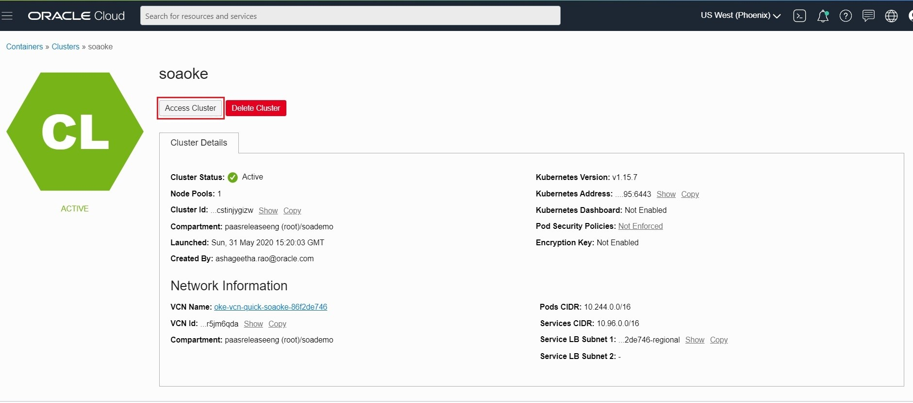

Click on the "Node Pools" on Resources and then "View" to view the Node Pool and worker node status

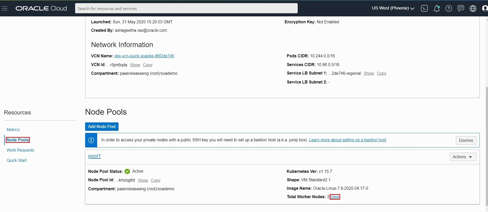

You can view the status of Worker node and make sure all Node State in Active and Kubernetes Node Condition is Ready. Note:  The worker node gets listed in the kubectl command once the "Kubernetes Node Condition" is Ready.

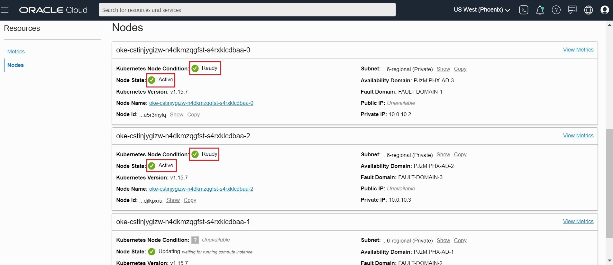

#### Prepare OCI CLI to download Kubernetes configuration file ####

When you create a cluster, you need to download a Kubernetes configuration file (commonly known as a `kubeconfig` file) for the cluster. To do so you have to add OCI API Signing key and configure OCI CLI on your workstation (Virtualbox environment).

##### Configure OCI CLI #####

Before using the CLI, you have to create a config file that contains the required credentials for working with Oracle Cloud Infrastructure. To have this config the CLI walks you through the first-time setup process, step by step, use the oci setup config command. The command prompts you for the information required for the config file and the API public/private keys. The setup dialog generates an API key pair and creates the config file.

Before you start the setup collect the necessary information using your OCI console.

- User OCID
- Tenancy OCID
- Region

In the Console click on your OCI user name and select User Settings. On the user details page you can find the *user OCID*. Click **Copy** and paste temporary to a text editor.

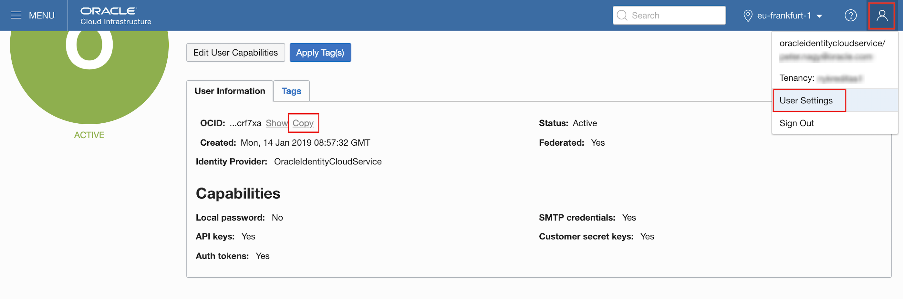

To identify *tenancy OCID* in the Console, open the navigation menu. Under *Governance and Administration*, go to *Administration* and click **Tenancy Details**. Click **Copy** to get tenancy OCID on clipboard. Paste to your text editor for OCI CLI configuration.

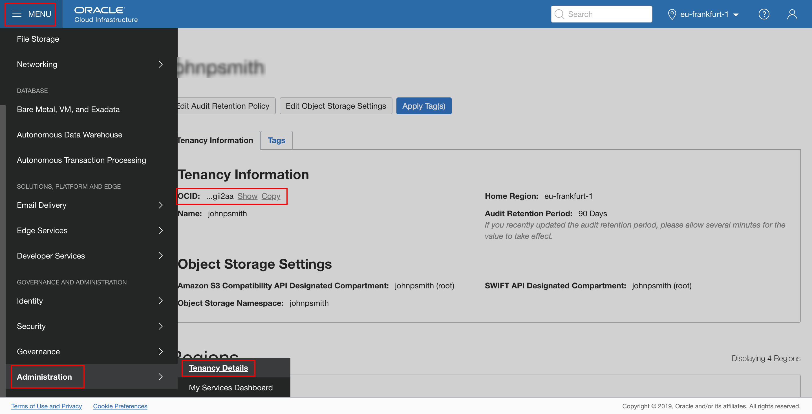

Leave the console open during CLI configuration and copy the required information from the console page or from text editor where you collected the OCIDs (user and tenancy). When you want to accept the default value what is offered in square bracket just hit Enter. Now we need to install OCI CLI, by doing this:
```
cd
mkdir bin
bash -c "$(curl -L https://raw.githubusercontent.com/oracle/oci-cli/master/scripts/install/install.sh)"
cd
vi .bashrc
export PATH=$HOME/bin:$PATH
```
Note: If you need to install OCI CLI then follow the [documentation](https://docs.cloud.oracle.com/iaas/Content/API/SDKDocs/cliinstall.htm).

By default all the OCI CLI installation result will be placed in OS user home directory. Execute oci setup config command to setup the CLI:

	$ oci setup config
	    This command provides a walkthrough of creating a valid CLI config file.

	    The following links explain where to find the information required by this
	    script:

	    User OCID and Tenancy OCID:

	        https://docs.us-phoenix-1.oraclecloud.com/Content/API/Concepts/apisigningkey.htm#Other

	    Region:

	        https://docs.us-phoenix-1.oraclecloud.com/Content/General/Concepts/regions.htm

	    General config documentation:

	        https://docs.us-phoenix-1.oraclecloud.com/Content/API/Concepts/sdkconfig.htm


	Enter a location for your config [/home/oracle/.oci/config]:

Enter to accept default directory location. Provide your user and tenancy OCIDs.

	Enter a user OCID: <YOUR_USER_OCID>
	Enter a tenancy OCID: <YOUR_TENANCY_OCID>

Enter your region. You can see in the console (browser) at the top right area. It has to be *eu-frankfurt-1*, if not type the proper region code.

	Enter a region (e.g. eu-frankfurt-1, uk-london-1, us-ashburn-1, us-phoenix-1): <YOUR_REGION>

Generate new API signing key. For the location accept default. Don't use a passphrase for the private key.

	Do you want to generate a new RSA key pair? (If you decline you will be asked to supply the path to an existing key.) [Y/N]: Y

	Enter a directory for your keys to be created [/home/oracle/.oci]:
	Enter a name for your key [oci_api_key]:
	Public key written to: /home/oracle/.oci/oci_api_key_public.pem
	Enter a passphrase for your private key (empty for no passphrase):
	Private key written to: /home/oracle/.oci/oci_api_key.pem
	Fingerprint: 41:ea:cf:23:01:a2:bb:fb:84:79:34:8e:fe:bc:18:4f
	Config written to /home/oracle/.oci/config

##### Upload the public key of the API signing key pair #####

The final step to complete the CLI setup to upload your freshly generated public key through the console. The public key if you haven't changed it during setup can be found in the `/home/oracle/.oci/` directory and it's name `oci_api_key_public.pem`. Using your favourite way copy its content to the clipboard. While viewing user details click **Add Public Key**.

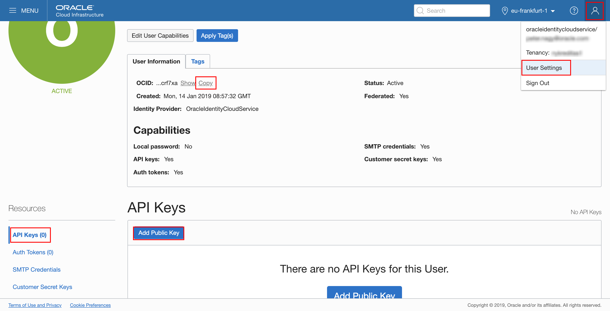

Copy the content of the `oci_api_key_public.pem` file into the *PUBLIC KEY* text area and click **Add**.

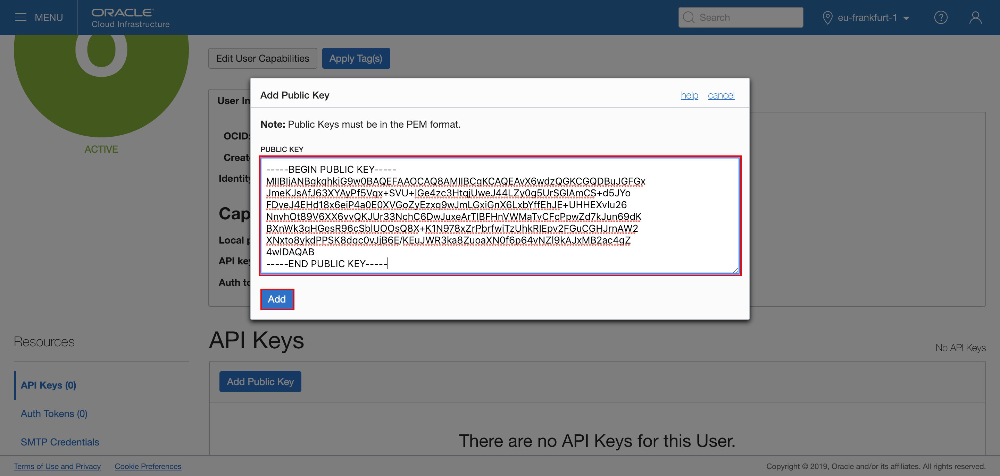

The key is uploaded and its fingerprint is displayed in the list.

##### Configure kubectl #####

Now we need to install kubectl in the bastion pc, which can be done by:
```
cd
cd bin
curl -LO https://storage.googleapis.com/kubernetes-release/release/`curl -s https://storage.googleapis.com/kubernetes-release/release/stable.txt`/bin/linux/amd64/kubectl
chmod 755 kubectl
```
Note: If you need to install `kubectl` then follow the [documentation](https://kubernetes.io/docs/tasks/tools/install-kubectl/).

The CLI setup now is done. To complete the `kubectl` configuration open the navigation menu and under **Developer Services**, click **Kubernetes Clusters**. Select your cluster and click to get the detail page and click **Access Kubeconfig**.


A dialog pops up which contains the customized OCI command that you need to execute to create Kubernetes configuration file.

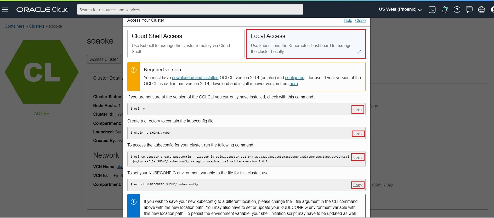

After making sure the firewall and SELINUX is disabled or configured properly then copy and execute the commands on your desktop where OCI CLI was configured. For example:

	$ mkdir -p $HOME/.kube
	$ oci ce cluster create-kubeconfig --cluster-id ocid1.cluster.oc1.eu-frankfurt-1.aaaaaaaaaezwenlfgm4gkmzxha2tamtcgjqwmoldmu3tcnlfgc2tcyzzmrqw --file $HOME/.kube/config --region eu-frankfurt-1

Note! For `kubectl` try to use by defult `$HOME/.kube/config` configuration file. If you save it to a different location and use different filename, don't forget to set the `KUBECONFIG`  variable to the configuration file. E.g.:

	cd
	vi .bashrc
	export KUBECONFIG=another_folder_path/kubernetes_config_file_name

Now check that `kubectl` is working, for example using the `get node` command:

	$ kubectl get node
	NAME            STATUS    ROLES     AGE       VERSION
	130.61.58.206   Ready     node      16m       v1.15.7
	130.61.60.127   Ready     node      16m       v1.15.7
	130.61.72.48    Ready     node      16m       v1.15.7

If you see the node's information the configuration was successful. Probably the Name column will contain the IPs that are non-routable

##### Set up the RBAC policy for the OKE cluster #####

In order to have permission to access the Kubernetes cluster, you need to authorize your OCI account as a cluster-admin on the OCI Container Engine for Kubernetes cluster. This will require your user OCID, which you used to configure OCI CLI few steps above. (This information available on the OCI console page, under your user settings.)


Then execute the role binding command using your(!) user OCID:

	kubectl create clusterrolebinding my-cluster-admin-binding --clusterrole=cluster-admin --user=<YOUR_USER_OCID>

For example:

	$ kubectl create clusterrolebinding my-cluster-admin-binding --clusterrole=cluster-admin --user=ocid1.user.oc1..aaaaaaaa724gophmrcxxrzg3utunh3rg5ieeyyrwuqfetixdb3mhzesxmdbq
	clusterrolebinding "my-cluster-admin-binding" created

To enable access to Kubernetes dashboard and enable Oracle Pipelines (Wercker) access Kubernetes, create another admin user then copy the TOKEN value inside kube config and put that Wercker:

	cat << EOF | kubectl apply -f -
	apiVersion: v1
	kind: ServiceAccount
	metadata:
	  name: oke-admin
	  namespace: kube-system
	---
	apiVersion: rbac.authorization.k8s.io/v1beta1
	kind: ClusterRoleBinding
	metadata:
	  name: oke-admin
	roleRef:
	  apiGroup: rbac.authorization.k8s.io
	  kind: ClusterRole
	  name: cluster-admin
	subjects:
	- kind: ServiceAccount
	  name: oke-admin
	  namespace: kube-system
	EOF 

	TOKENNAME=`kubectl -n kube-system get serviceaccount/oke-admin -o jsonpath='{.secrets[0].name}'`
	TOKEN=`kubectl -n kube-system get secret $TOKENNAME -o jsonpath='{.data.token}'| base64 --decode`
	kubectl config set-credentials oke-admin --token=$TOKEN

To access Kuberenetes dashboard inside the terminal execute below (if using Putty please enable port forwarding):
	
	kubectl proxy
	
Then go to browser and open this link:

	http://localhost:8001/api/v1/namespaces/kube-system/services/https:kubernetes-dashboard:/proxy/#!/login
	
Congratulation, now your OCI OKE environment is ready to deploy your WebLogic domain.
